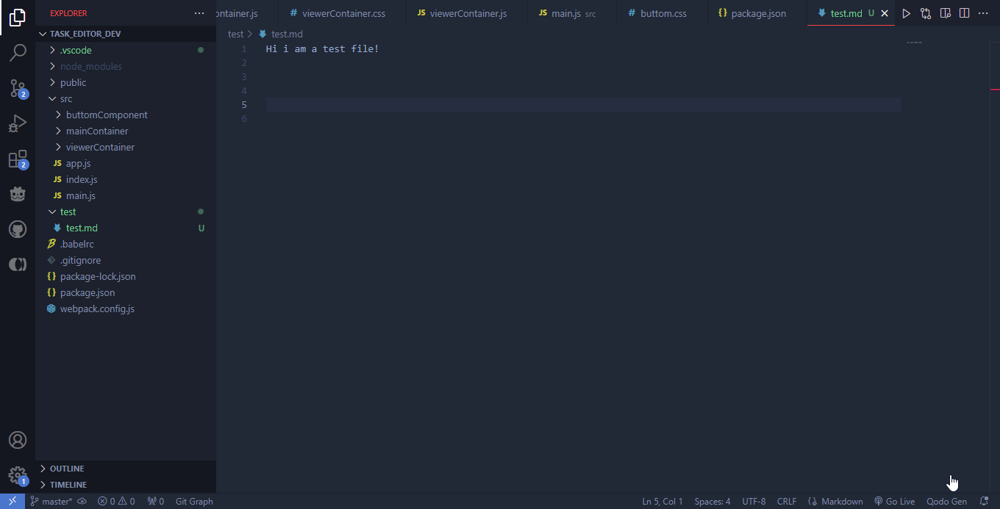

# Copy Project Context VS Code Extencion

## A easy tool for vs code that allows you to copy your project structure and files in a fast way to use as context for asking to your favorite IA model or anything else. 

Sometimes explaining what your project do, state is, structure are or technologies are involved takes time to explain properly to an IA or anything else. That's why I create this extension that allows you to copy the project structure and files from the vs code explorer.

The project structure can give valuable information about the type of project, the current state of the project, the technologies used and general information about it. sometimes it is all an IA needs to better understand your projects problems, errors and questions.

## Features

This extension adds 4 commands each with one button:

### 1. Copy Project Context  
- **Command**: `copy-project-context.copy-project-context`  
- **Button Label**: *Copy Project Context*  
- **Description**: Copies the project structure and the content of all files added to the context.  
- **Button Visibility**: Shown when right-clicking on any part of the file explorer.  

### 2. Add File Content to Context  
- **Command**: `copy-project-context.add-file-path-to-context`  
- **Button Label**: *Add File Content to Project Context*  
- **Description**: Adds the content of a file to the project context for copying.  
- **Button Visibility**: Shown when right-clicking on a file in the file explorer.  

### 3. Delete All Files from Context  
- **Command**: `copy-project-context.delete-file-paths-of-context`  
- **Button Label**: *Delete All Files From Project Context*  
- **Description**: Clears all files from the project context.  
- **Button Visibility**: Shown when right-clicking on any part of the file explorer.  

### 4. Show All Files in Context  
- **Command**: `copy-project-context.show-all-file-paths-from-context`  
- **Button Label**: *Show All Files in Project Context*  
- **Description**: Displays a list of all files currently added to the project context.  
- **Button Visibility**: Shown when right-clicking on any part of the file explorer. 

####
---
#### Gift showing all the features and use of the extension

####

## Extension Settings

This extension contributes the following settings:

* `copy-project-context.ignoreFilesOnAllFolders`: A list of file names to ignore in all the project folders.
* `copy-project-context.filePathsToContext`: The list of uris objects of each file added to the context.
* `copy-project-context.ignoreFilesOnWorkspaceFolder`: A list of file names to ignore only in the workspace's main folder.
* `copy-project-context.ignoreFilesOnSubFolders`: A list of file names to ignore in the project's subfolders.
* `copy-project-context.maxNumberOfItemsPerFolder`: The maximum number of items to analyze per folder. If a folder contains more than this number of items (folders and files), its content will be ignored in the context.

## Known Issues

No known issues for now.

